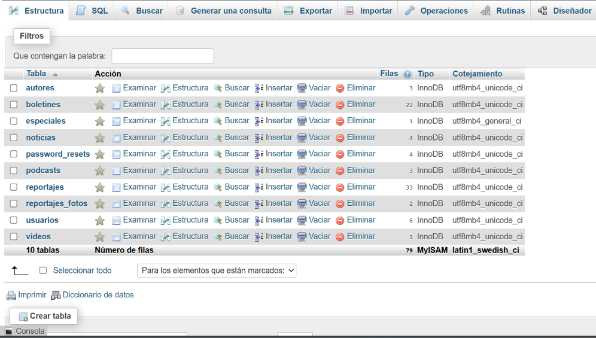
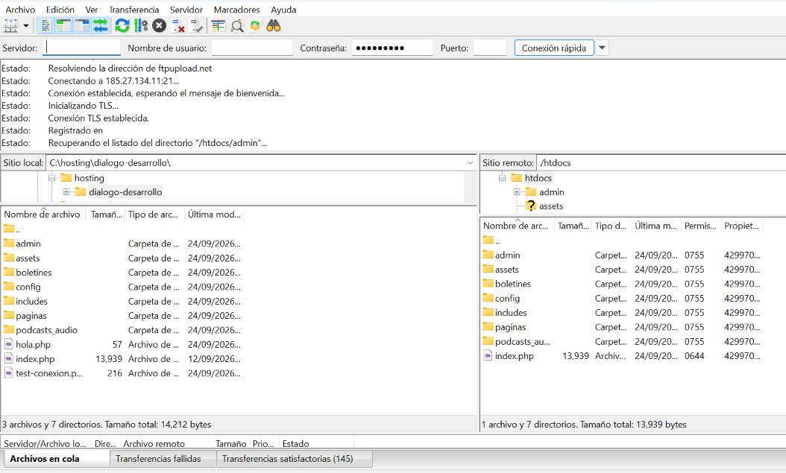
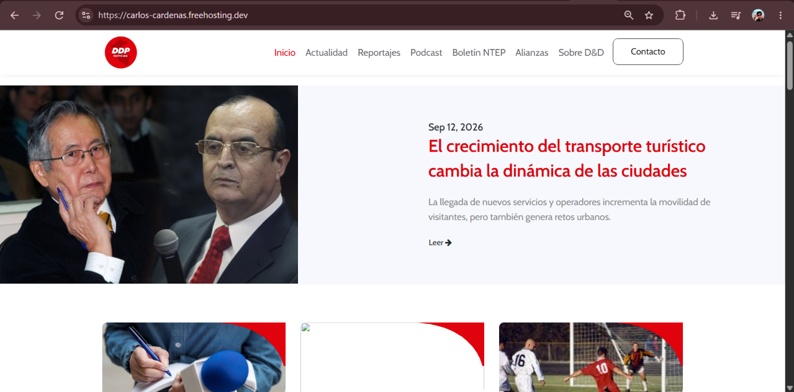
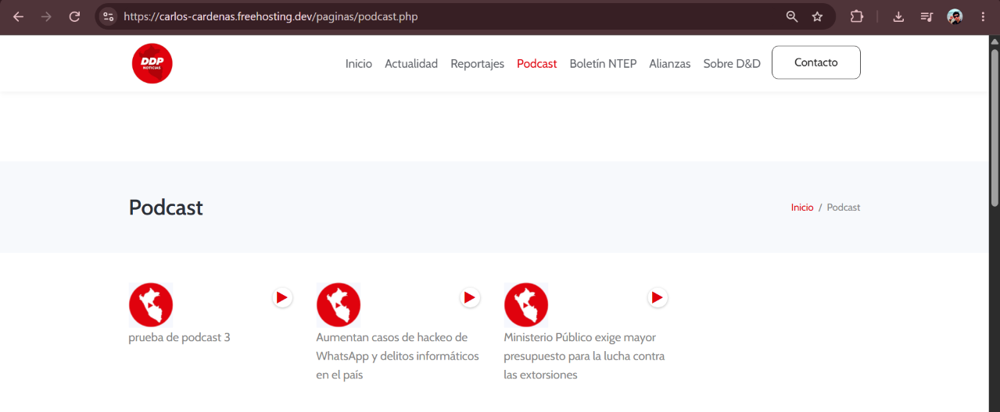
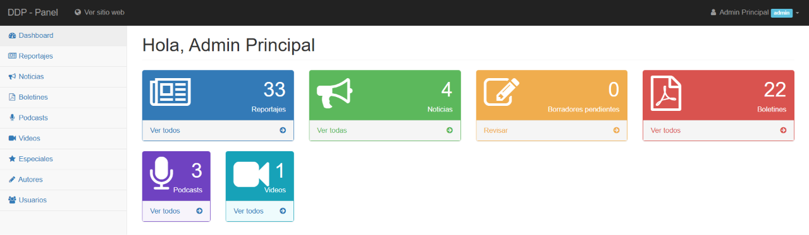

# Diálogo y Desarrollo: sitio web (PHP + MySQL)

Proyecto académico inspirado en https://www.dialogoydesarrollo.com.pe/
Curso: Plataformas para el Desarrollo de Aplicaciones, Ingeniería de Sistemas, 2026-II.

## Sitio en vivo
https://carlos-cardenas.freehosting.dev/  |  Panel: https://carlos-cardenas.freehosting.dev/admin
Usuario de revisión (rol editor): correo `revisar@ddp.pe` / contraseña `revision123`

## Características
- Sitio público: Inicio, Reportajes, Boletines, Podcast (reproductor anclado) y Contacto.
- Panel de administración con login (password_hash) y CRUD de reportajes, noticias,
  boletines, podcasts, videos, especiales, autores y usuarios (roles admin/editor/redactor).

## Tecnologías
PHP 8 (PDO), MySQL/MariaDB, Bootstrap, JavaScript. Desarrollo local con XAMPP.

## Instalación local (XAMPP)
1. Copia el proyecto en `C:\xampp\htdocs\dialogo-desarrollo`.
2. En phpMyAdmin crea la BD `revista_digital` (utf8mb4) e importa `database/schema.sql` y luego
   `database/seed.sql`. No ejecutes los `migracion_*.sql` (ya incluidos en schema.sql).
3. Abre http://localhost/dialogo-desarrollo/

## Despliegue (InfinityFree)
1. Crear cuenta y sitio, crear la base de datos MySQL e importar el export desde phpMyAdmin.
2. Copiar el proyecto (sin .git ni database/) y, en la copia, poner `BASE_URL = ''` y las
   credenciales de la BD del hosting en `config/db.php`.
3. Subir por FTP (FileZilla) a `htdocs`. Probar `hola.php`, luego la conexión a la BD, luego la app.

## Seguridad
- Las credenciales del hosting no están en el repositorio: solo viven en el servidor.
- Contraseñas con `password_hash`; consultas con sentencias preparadas (PDO).
- Limitación conocida: en "Olvidé mi contraseña", el enlace se muestra en pantalla si `mail()` no está disponible.

## Capturas del despliegue

